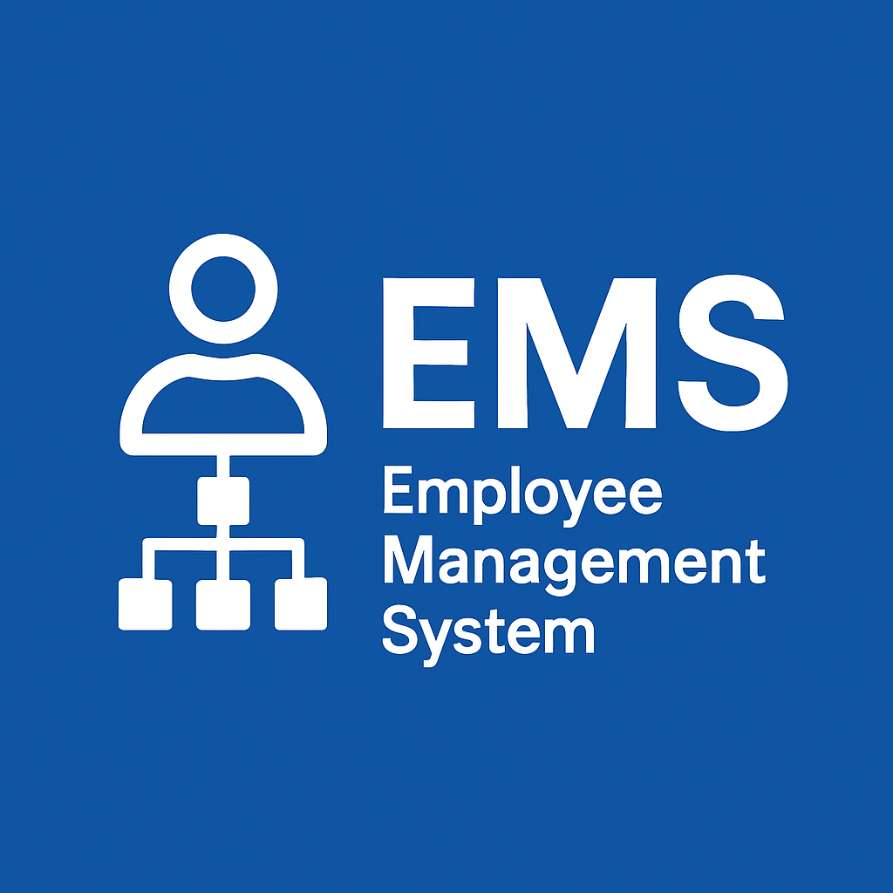
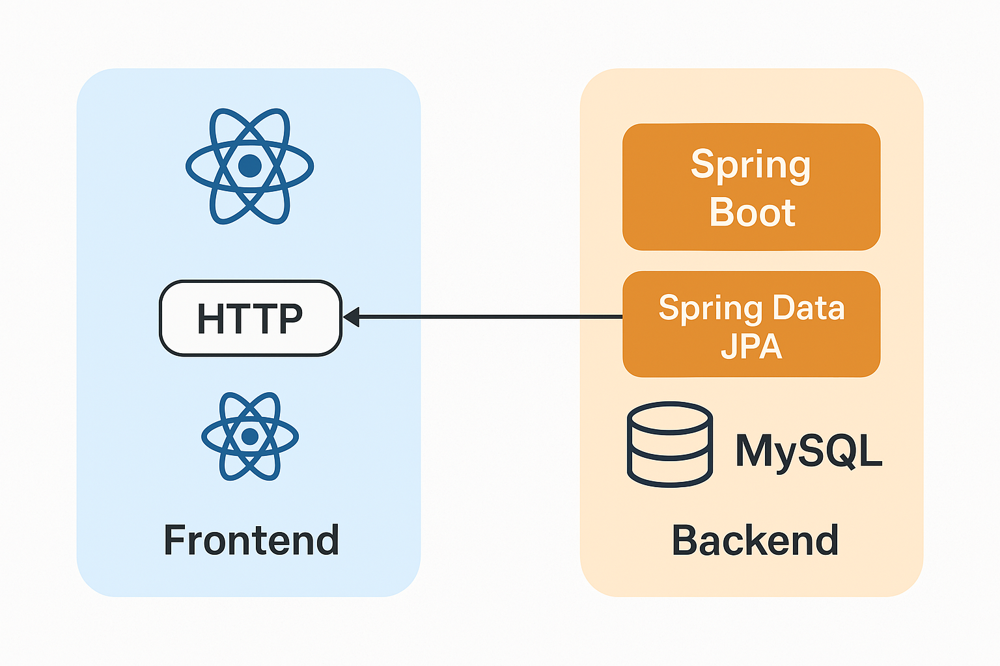

# Employee Management System (EMS) 🚀



## Welcome to Employee Management System 🎉
The **Employee Management System (EMS)** is a cutting-edge, full-stack web application designed to streamline employee data management for organizations. Built with a modern **React.js** frontend and a powerful **Spring Boot** backend, EMS ensures efficiency, scalability, and a seamless user experience.

---

## 📌 Table of Contents
- [Overview](#overview)
- [Key Features](#key-features)
- [Technical Stack](#technical-stack)
- [System Architecture](#system-architecture)
- [Installation Guide](#installation-guide)
- [Usage Guide](#usage-guide)
- [API Documentation](#api-documentation)
- [Project Structure](#project-structure)
- [Development Guidelines](#development-guidelines)
- [License](#license)
- [Roadmap](#roadmap)
- [Contributors](#contributors)
- [Support & Contact](#support--contact)

---

## 🌟 Overview
The **Employee Management System** is designed for organizations looking to manage employee records efficiently. It allows HR personnel to perform CRUD operations (Create, Read, Update, Delete) on employee records while managing departments and user roles seamlessly.

- **🎯 Purpose**: Efficient and scalable employee data management
- **👥 Target Audience**: HR departments, SMEs, developers learning full-stack development
- **🔖 Version**: `1.0.0`

---

## 🔥 Key Features
✅ **Employee Management**: Add, update, view, and delete employees
✅ **Department Management**: Assign and manage employee departments
✅ **User Roles & Authentication**: Secure access control with authentication & authorization
✅ **Intuitive UI**: Clean and user-friendly interface with responsive design
✅ **Robust Backend**: Built with Spring Boot for scalable API handling
✅ **Real-time Data Validation**: Ensure data integrity using client-side and server-side validation
✅ **RESTful API**: Well-documented, secure endpoints for seamless frontend-backend interaction
✅ **Logging & Error Handling**: Proper logging system and user-friendly error messages
✅ **Mobile-Friendly**: Fully responsive design for all devices

---

## 🏗️ Technical Stack
### **Frontend** (React.js)
- **Framework**: React.js (Vite for development speed)
- **UI Styling**: Bootstrap, CSS3
- **State Management**: Context API
- **HTTP Requests**: Axios
- **Routing**: React Router

### **Backend** (Spring Boot)
- **Framework**: Spring Boot `3.4.4`
- **Database**: MySQL
- **ORM**: Spring Data JPA with Hibernate
- **Security**: Spring Security (expandable with JWT)
- **Dependency Management**: Maven

### **Development & Tools**
- **Version Control**: Git & GitHub
- **IDE**: IntelliJ IDEA / VS Code
- **Testing**: JUnit, Postman for API testing

---

## 🏛 System Architecture
```plaintext
[Frontend] -- React.js, Bootstrap, Axios
   |
   v
[Backend] -- Spring Boot (JPA, Hibernate, REST API)
   |
   v
[Database] -- MySQL
```



---

## ⚡ Installation Guide
### Prerequisites ✅
- **Node.js** & **npm** (`18+`): [Download](https://nodejs.org/)
- **JDK 21+**: [Download](https://www.oracle.com/java/technologies/javase/jdk21-archive-downloads.html)
- **MySQL 8+**: [Download](https://www.mysql.com/)
- **Git**: [Download](https://git-scm.com/)

### 🚀 Quick Start
#### 1️⃣ Clone the Repository
```bash
git clone https://github.com/ezekielemana/ems-project.git
cd ems-project
```

#### 2️⃣ Backend Setup
```bash
cd backend
./mvnw spring-boot:run
```

#### 3️⃣ Frontend Setup
```bash
cd frontend
npm install
npm run dev
```

#### 4️⃣ Open in Browser
Go to: `http://localhost:3000`

---

## 🛠 Usage Guide
1. **Sign in** as an admin or HR personnel.
2. **Navigate** to Employee Dashboard.
3. **Manage Employees**: Create, view, update, delete records.
4. **Assign Departments** to employees.
5. **Logout** securely after managing data.

---

## 📑 API Documentation
The API follows RESTful principles:
- `GET /employees` - Retrieve all employees
- `POST /employees` - Create a new employee
- `PUT /employees/{id}` - Update an employee record
- `DELETE /employees/{id}` - Delete an employee
- `GET /departments` - Retrieve all departments

For full API documentation, visit: **`/api/docs`** (Swagger UI)

---

## 📂 Project Structure
```plaintext
ems-project/
├── frontend/          # React-based frontend
│   ├── src/
│   │   ├── components/    # Reusable UI components
│   │   ├── services/      # API service calls
│   │   ├── App.jsx       # Main application component
│   │   ├── index.js      # Entry point
│   └── package.json      # Frontend dependencies
├── backend/           # Spring Boot backend
│   ├── src/
│   │   ├── main/
│   │   │   ├── java/
│   │   │   │   └── net/emsapp/ems_backend/
│   │   │   │       ├── controller/    # REST controllers
│   │   │   │       ├── dto/          # Data transfer objects
│   │   │   │       ├── entity/       # Database entities
│   │   │   │       ├── exception/    # Custom exceptions
│   │   │   │       ├── mapper/       # Object mapping utilities
│   │   │   │       ├── repository/   # JPA repositories
│   │   │   │       ├── service/      # Business logic
│   │   │   └── resources/            # Configuration files
│   │   └── test/                     # Unit tests
│   └── pom.xml                       # Maven build file
├── README.md
└── .gitignore
```

---

## 🔧 Development Guidelines
- Follow **clean code principles**
- Use **feature branching** for Git workflow
- Commit messages should be **clear & concise**

---

## 📝 License
This project is HAS NO licensed under ANY ORGANISATION
---

## 🚀 Roadmap
- [ ] Implement JWT Authentication
- [ ] Add Role-based Access Control
- [ ] Improve UI/UX with Material-UI
- [ ] Implement GraphQL API

---

## 🤝 Contributors
🔹 [Ezekiel Lemana](https://github.com/ezekielemana) - Project Lead, Backend Developer, Frontend Developer

---

## 📞 Support & Contact
Need help? Feel free to reach out:
📧 **Email**: ezekielaugustino@gmail.com
📸 **Instagram**: [Enzo_leman10](https://www.instagram.com/enzo_leman10/)
🐛 **Report Issues**: [GitHub Issues](https://github.com/ezekielemana/ems-project/issues)

---

### 🎯 Your feedback makes me better! 🚀

